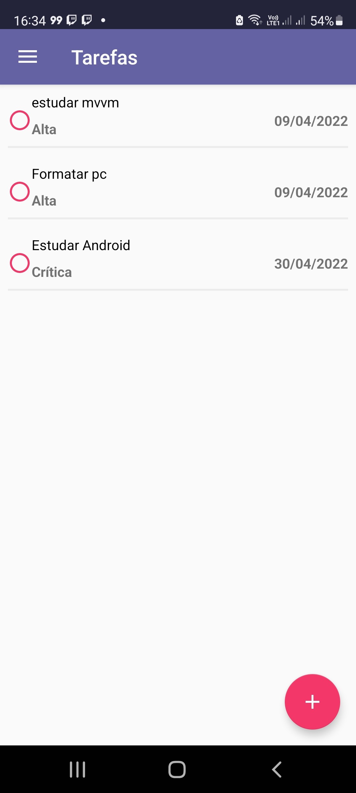
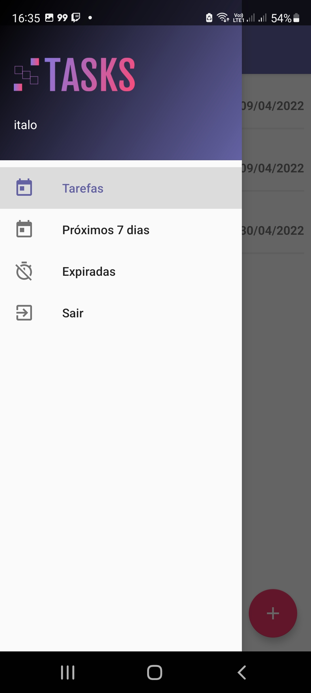
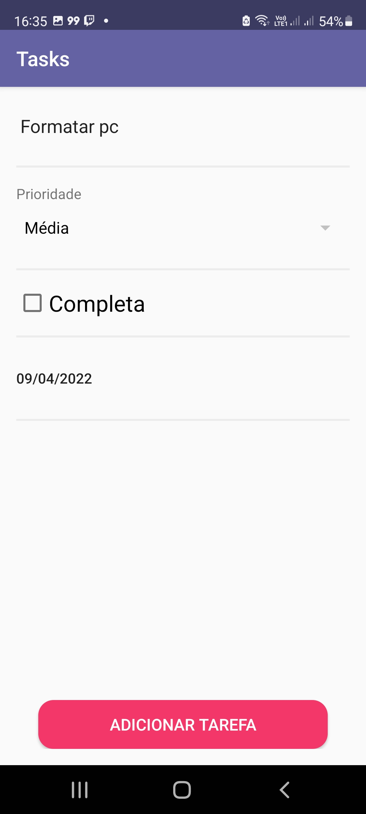
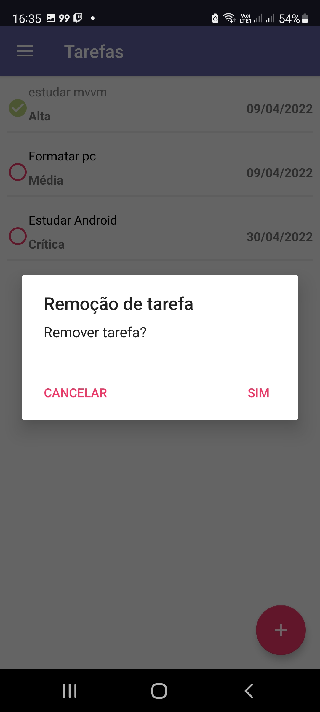

<h1 align="center">
  
</h1>

<h1 align="center">Aplicativo Tasks</h1>

Aplicativo para auxiliar o usuário na administração de suas tarefas. O usuário pode criar uma tarefa com descrição, data, prioridade e status de completa ou não. Pode listar todas as tarefas, tarefas para realizar nos próximos 7 dias e tarefas expiradas.Desenvolvido durante o curso Android com Kotlin na udemy.

<h3 Features /?>

- [x] Cração de conta
- [x] Login do usuário
- [x] Criação de tarefas
- [x] Descrição de tarefas
- [x] Datas nas tarefas
- [x] Prioridade de tarefas
- [x] Edição de tarefas
- [x] Remoção de tarefas

-------------------------------------------------------------------------------------------------------------------------------------------------------------------------
<h2>Captura de tela</h2>

      

-------------------------------------------------------------------------------------------------------------------------------------------------------------------------
<h2>Tecnologias</h2>

- <a href="https://kotlinlang.org/">Kotlin</a>
- <a href="https://developer.android.com/studio/">Android Studio</a>
- <a href="https://developer.android.com/training/data-storage/room">Room</a>
- <a href="https://square.github.io/retrofit/">Retrofit</a>
- <a href="http://devmasterteam.com/cursoandroid/api">API</a>
- <a href="https://developer.android.com/jetpack/guide?gclid=CjwKCAjwi6WSBhA-EiwA6Niok5Zh9FiIszci8L0PjZTdjS2hOefqAY2hA70mSTS_wyn6UMZqzL-g5BoC8jgQAvD_BwE&gclsrc=aw.ds">MVVM</a>
- <a href="https://developer.android.com/reference/android/content/SharedPreferences">Shared Preferences</a>
- <a href="https://www.sqlite.org/index.html">SQlite</a>
